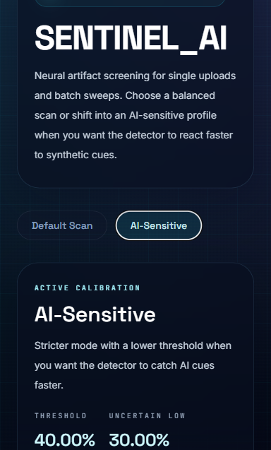

# Real Image vs AI Image Checker

Project report for SENTINEL_AI  
Deployed website: https://huggingface.co/spaces/Lucifer9907/SDK-Docker

## Chapter 1: Introduction

Artificial intelligence image generation tools can now create realistic portraits, landscapes, product images, and social media content. As these images become more convincing, it becomes difficult for a normal user to identify whether an image was captured by a camera or generated by an AI model. This creates challenges in digital trust, misinformation control, academic integrity, content moderation, and image verification.

The Real Image vs AI Image Checker project, named SENTINEL_AI in the implementation, is a machine learning based web application that classifies uploaded images as Real, AI-generated, or Uncertain. The system uses a convolutional neural network with transfer learning and exposes the trained model through a FastAPI web service. The final application is deployed as a Docker based Hugging Face Space so that users can access it through a browser.

The project focuses on practical usability as well as model performance. It supports single image prediction, batch image prediction, a balanced default scan mode, and a stricter AI-sensitive scan mode. This makes the system useful for both quick casual checks and stricter screening scenarios.

## Chapter 2: Problem Statement and Objectives

### Problem Statement

The problem addressed by this project is to build an automated image classification system that can analyze a given image and predict whether it is real or AI-generated. Manual inspection is unreliable because AI images may contain very subtle artifacts, and different generators produce different visual patterns. Therefore, a trained machine learning model is required to learn discriminative visual features from examples of real and synthetic images.

### Objectives

- To collect and prepare a labeled dataset containing real and fake images.
- To preprocess all input images into a consistent format suitable for CNN based classification.
- To train a binary image classifier using transfer learning.
- To evaluate the trained model using accuracy, precision, recall, F1-score, and confusion matrix.
- To build a user-friendly web interface for single image and batch image checking.
- To provide two scanning modes: Default Scan and AI-Sensitive Scan.
- To deploy the final system online using Hugging Face Spaces with Docker.

## Chapter 3: Requirements and Dataset Description

### Software Requirements

| Requirement | Description |
|---|---|
| Programming language | Python |
| Deep learning framework | TensorFlow and Keras |
| Image processing | OpenCV and NumPy |
| Web backend | FastAPI |
| Web server | Uvicorn |
| Frontend | HTML, Tailwind CSS, and JavaScript |
| Deployment | Docker and Hugging Face Spaces |
| Evaluation tools | scikit-learn metrics |

### Hardware Requirements

| Requirement | Minimum Recommendation |
|---|---|
| Processor | Multi-core CPU |
| RAM | 8 GB or above for local training experiments |
| Storage | Sufficient disk space for dataset and model artifacts |
| GPU | Optional, but recommended for faster training |
| Deployment hardware | Hugging Face Space CPU runtime for inference |

### Functional Requirements

- The system should allow users to upload an image file.
- The system should return a class label, AI probability, and confidence score.
- The system should support batch prediction for multiple image files.
- The system should expose API endpoints for prediction and health checking.
- The system should display clear results in a browser-based interface.

### Non-Functional Requirements

- The interface should be simple and responsive.
- The backend should handle invalid or empty image uploads safely.
- The trained model should load automatically when the server starts.
- The deployed application should run inside a Docker container.
- The system should provide results quickly enough for interactive use.

### Dataset Description

The dataset is organized into two classes: real and fake. The processed local dataset contains 24,763 real images and 24,053 fake images, giving a total of 48,816 processed images available for experiments. The implementation also includes raw data, processed data, holdout data, and archived balancing material.

For the saved fast training run, a balanced subset was used to reduce training time. The training script limits the dataset to 5,000 images per class, giving 10,000 images total. This subset is split into approximately 70% training, 20% validation, and 10% testing. The final saved test evaluation was performed on 1,000 test images.

Each image is resized to 224 x 224 pixels and converted into RGB format. MobileNetV2 preprocessing is applied, scaling inputs into the range expected by the ImageNet-pretrained base model. The class label real is encoded as 0 and fake is encoded as 1.

## Chapter 4: Design

### System Architecture

The system follows a simple deployment-oriented architecture:

| Layer | Component | Role |
|---|---|---|
| User interface | HTML, Tailwind CSS, JavaScript | Allows image upload, scan mode selection, result display, and batch scanning |
| API layer | FastAPI | Provides `/`, `/health`, `/predict`, and `/predict/batch` routes |
| Inference layer | TensorFlow/Keras model loader and prediction functions | Loads the trained model and computes AI probability |
| Model layer | MobileNetV2 transfer learning classifier | Extracts image features and predicts real/fake probability |
| Deployment layer | Docker and Hugging Face Spaces | Packages and hosts the application online |

### Model Design

The classifier uses MobileNetV2 as a transfer learning backbone. MobileNetV2 is loaded without its original classification head and with ImageNet weights. A custom binary classification head is then added:

- GlobalAveragePooling2D layer
- Dropout layer with rate 0.3
- Dense layer with 128 ReLU units
- Dropout layer with rate 0.2
- Dense output layer with sigmoid activation

The sigmoid output represents the probability that the image belongs to the fake or AI-generated class. During training, binary cross-entropy is used as the loss function, and metrics include accuracy, precision, recall, and AUC.

### Prediction Design

The inference pipeline accepts uploaded image bytes, decodes the image using OpenCV, resizes it to 224 x 224, applies MobileNetV2 preprocessing, and passes the image to the trained model. The system then converts the model probability into a user-facing label.

Two scan modes are implemented:

| Mode | Threshold | Uncertain Range | Purpose |
|---|---:|---:|---|
| Default Scan | 0.65 | 0.45 to 0.70 | Balanced mode with orientation-conservative scoring |
| AI-Sensitive Scan | 0.40 | 0.30 to 0.50 | Stricter mode that reacts faster to possible AI signals |

Default Scan performs additional rotation and flip based checks and uses conservative scoring to reduce false AI predictions on real photos. AI-Sensitive Scan uses a lower threshold to catch more possible AI-generated images.

## Chapter 5: Implementation and Testing

### Implementation

The project is implemented as a Python machine learning web application. The trained model is stored at `artifacts/ai_image_detector.keras`. The main FastAPI entry point is `main.py`, and the frontend is served from `static/index.html`.

The backend exposes the following routes:

| Route | Method | Description |
|---|---|---|
| `/` | GET | Serves the web interface |
| `/health` | GET | Returns a simple health status |
| `/predict` | POST | Accepts one uploaded image and returns prediction output |
| `/predict/batch` | POST | Accepts multiple uploaded images and returns prediction output for each file |

Training is performed in two stages. In the first stage, the MobileNetV2 base is frozen and only the custom classification head is trained. In the second stage, selected later layers of the base model are unfrozen for fine-tuning. The training script uses early stopping, learning rate reduction, and model checkpointing to save the best model.

The frontend provides a cyberpunk-styled visual interface with scan mode selection, single image upload, batch upload, AI probability display, confidence display, and prediction labels. The deployment uses a Dockerfile based on Python 3.12 slim, installs inference dependencies, copies the application files and artifacts, exposes port 7860, and starts Uvicorn.

### Testing

Testing was performed using model evaluation metrics, route-level validation logic, and interface checks. The model was evaluated on a held-out test split using scikit-learn metrics. The backend validates empty uploads and unsupported scan modes. Image decoding errors are caught and returned as clear API errors.

The main testing areas were:

- Model accuracy and F1-score on the test set.
- Correct generation of the confusion matrix and classification report.
- Single image prediction API behavior.
- Batch prediction API behavior.
- Correct mode-specific calibration in Default Scan and AI-Sensitive Scan.
- Frontend rendering and scan mode switching.
- Docker configuration for Hugging Face Space deployment.

## Chapter 6: Result, Performance Measures, and Screenshots

### Performance Measures

The saved evaluation metrics show that the model achieved strong classification performance on the 1,000-image test set.

| Metric | Value |
|---|---:|
| Test accuracy | 88.80% |
| Fake/AI F1-score | 88.41% |
| Macro average F1-score | 88.79% |
| Weighted average F1-score | 88.80% |
| Validation accuracy from threshold calibration | 89.30% |
| Validation fake F1-score from threshold calibration | 89.25% |

### Class-wise Report

| Class | Precision | Recall | F1-score | Support |
|---|---:|---:|---:|---:|
| Real | 89.69% | 88.65% | 89.17% | 520 |
| Fake / AI-generated | 87.86% | 88.96% | 88.41% | 480 |

### Confusion Matrix

| Actual / Predicted | Predicted Real | Predicted Fake |
|---|---:|---:|
| Actual Real | 461 | 59 |
| Actual Fake | 53 | 427 |

The confusion matrix shows that 461 real images and 427 fake images were correctly classified. The model produced 59 false positives, where real images were classified as fake, and 53 false negatives, where fake images were classified as real.

### Training Curves

The training curve shows increasing training accuracy and generally improving validation accuracy. Validation loss decreases overall, though some fluctuation remains, which is expected in image classification tasks with diverse real and AI-generated samples.

### Screenshots

The Default Scan mode provides balanced detection with a higher AI threshold and conservative orientation-based scoring.

The AI-Sensitive mode uses a lower AI threshold and is designed for stricter screening when the user wants to catch possible AI-generated content more aggressively.

### Result Summary

The system successfully classifies images into real, AI-generated, or uncertain categories and provides probability and confidence values to the user. With a test accuracy of 88.80% and fake-class F1-score of 88.41%, the model performs well for a mini project implementation. The final system is accessible through a Hugging Face Docker Space and supports both single image and batch prediction workflows.

## References

1. Hugging Face, "Docker Spaces." https://huggingface.co/docs/hub/spaces-sdks-docker
2. Hugging Face, "Spaces Overview." https://huggingface.co/docs/hub/spaces-overview
3. TensorFlow, "tf.keras.applications.MobileNetV2." https://www.tensorflow.org/api_docs/python/tf/keras/applications/MobileNetV2
4. M. Sandler, A. Howard, M. Zhu, A. Zhmoginov, and L.-C. Chen, "MobileNetV2: Inverted Residuals and Linear Bottlenecks," CVPR, 2018.
5. FastAPI, "FastAPI Documentation." https://fastapi.tiangolo.com/
6. OpenCV, "OpenCV-Python Tutorials." https://docs.opencv.org/4.x/d6/d00/tutorial_py_root.html
7. OpenCV, "Image file reading and writing." https://docs.opencv.org/master/d4/da8/group__imgcodecs.html
8. scikit-learn, "classification_report." https://scikit-learn.org/stable/modules/generated/sklearn.metrics.classification_report.html
9. scikit-learn, "confusion_matrix." https://sklearn.org/stable/modules/generated/sklearn.metrics.confusion_matrix.html
